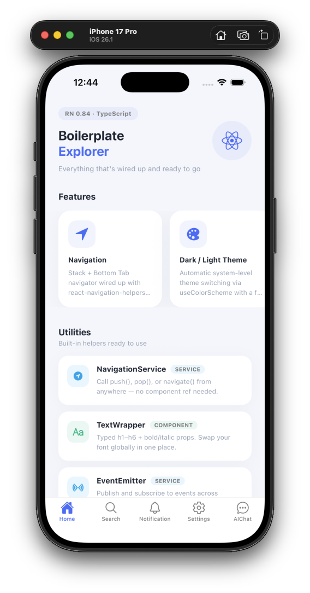
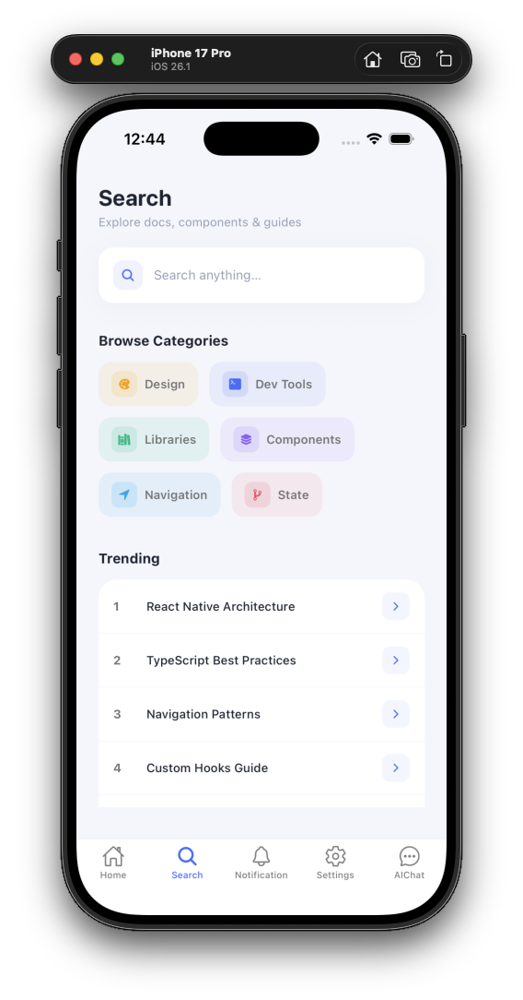
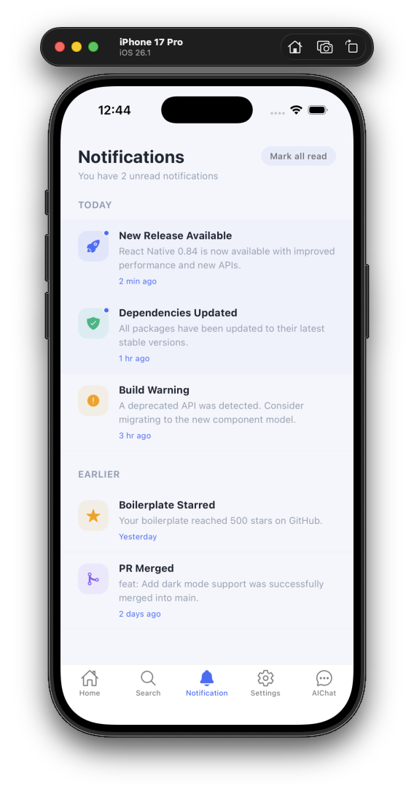
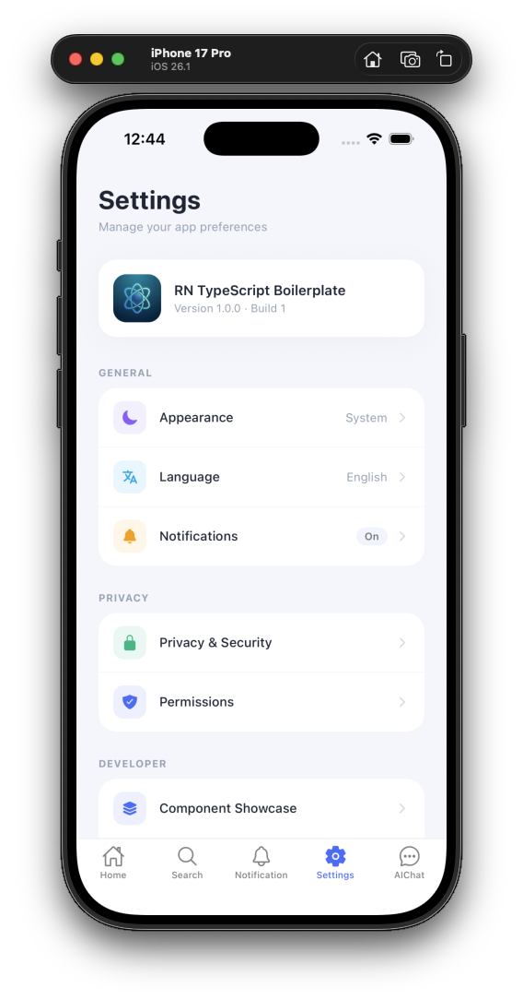

[](https://github.com/WrathChaos/react-native-typescript-boilerplate)
[](https://www.npmjs.com/package/@freakycoder/react-native-typescript-boilerplate)
[](https://www.npmjs.com/package/@freakycoder/react-native-typescript-boilerplate)

[](https://opensource.org/licenses/MIT)
[](https://github.com/prettier/prettier)
[](https://github.com/WrathChaos/react-native-typescript-boilerplate)

> **AI-Ready.** Production-grade React Native + TypeScript boilerplate with a built-in, provider-agnostic AI service layer. Wire up OpenAI, Anthropic Claude, Google Gemini — or any LLM — in minutes, not days.

> [!TIP]
> **Works great with AI coding assistants.** This repo ships with purpose-built guidance files so Cursor, Claude Code, GitHub Copilot, Windsurf, and Gemini CLI all understand the project conventions out of the box:
>
> | File | Used by |
> |---|---|
> | [`CLAUDE.md`](./CLAUDE.md) | Claude Code |
> | [`AGENTS.md`](./AGENTS.md) | Windsurf · Codex CLI · Gemini CLI |
> | [`.cursor/rules/`](./.cursor/rules/) | Cursor |
> | [`.github/copilot-instructions.md`](./.github/copilot-instructions.md) | GitHub Copilot |

> [!NOTE]
> All screens, components, and mock data included in this boilerplate are **for demonstration purposes only**. They exist to showcase the architecture, theming, navigation, and AI service layer — not to be kept as-is. Feel free to delete any screen, component, or piece of mock data and replace it with your own.

---

## Table of Contents

- [Showcase](#-showcase)
- [What's New in v6](#-whats-new-in-v6)
- [What's Included](#-whats-included)
- [Getting Started](#-getting-started)
- [Path Aliases](#-path-aliases)
- [AI Service Layer](#-ai-service-layer)
- [Theme System](#-theme-system)
- [Navigation](#-navigation)
- [Event Emitter](#-event-emitter)
- [Axios Hooks](#-axios-hooks)
- [Localization](#-localization)
- [Utilities](#-utilities)
- [AI Guidance Files](#-ai-guidance-files)
- [Code Quality](#-code-quality)
- [Project Structure](#-project-structure)

---

## 📸 Showcase

<p align="center">
  
  &nbsp;&nbsp;
  
  &nbsp;&nbsp;
  
  &nbsp;&nbsp;
  
</p>

---

## 🤖 What's New in v6

- **AI-Ready** — provider-agnostic AI service layer for OpenAI, Anthropic, and Gemini
- **`useAIChat`** hook — multi-turn conversations with streaming support, zero boilerplate
- **`useAICompletion`** hook — single-shot completions for text generation, classification, summarization
- **`RNAIMessage`** component — role-aware chat bubble with live streaming cursor
- **AI Chat screen** — fully functional demo: provider switcher, API key input, model name input, streaming toggle
- **AI Guidance Files** — `CLAUDE.md`, `AGENTS.md`, `.cursor/rules/`, `.github/copilot-instructions.md` so every AI coding assistant understands this codebase
- **`@hooks` path alias** — clean imports for all custom hooks

---

## 🎉 What's New in v5

- **React Native 0.84** + **React 19** — latest stable versions
- **New Architecture** enabled by default (`newArchEnabled=true`, Bridgeless / JSI)
- Redesigned **Boilerplate Explorer** HomeScreen
- Full **Montserrat** font family bundled (18 weights)
- `react-native-reanimated` **v4** + `react-native-worklets`
- Stricter **TypeScript** config with typed theme colors and navigation
- **Husky v9** pre-commit hooks (`prettier` + `lint` on every commit, `commitlint` on commit message)

---

## 🐶 What's Included

### AI Layer

| Feature | Description |
|---|---|
| AI Service | Provider-agnostic `sendAIMessage()` + `streamAIMessage()` — works with OpenAI, Anthropic, Gemini, or any compatible API |
| `useAIChat` | Multi-turn conversation hook with history, streaming, error state, and system prompt management |
| `useAICompletion` | Single-shot completion hook — perfect for generation, summarization, translation, classification |
| `RNAIMessage` | Role-aware chat bubble component (`user` / `assistant` / `system`) with streaming cursor |
| AI Chat Screen | Live demo screen with provider selector, API key input, model name field, streaming toggle |
| AI Guidance Files | `CLAUDE.md` · `AGENTS.md` · `.cursor/rules/` · `.github/copilot-instructions.md` |

### Core

| Feature | Library |
|---|---|
| Navigation | `@react-navigation/native` · `@react-navigation/stack` · `@react-navigation/bottom-tabs` |
| Navigation helpers | `react-navigation-helpers` — push/pop/navigate without component refs |
| HTTP | `axios` + `axios-hooks` |
| Animations | `react-native-reanimated` v4 + `react-native-gesture-handler` |
| Icons | `react-native-vector-icons` + `react-native-dynamic-vector-icons` |
| Localization | `i18next` + `react-i18next` |
| Safe Area | `react-native-safe-area-context` |
| Splash Screen | `react-native-splash-screen` |

### Developer Experience

- **Strict TypeScript** — extended theme types, typed palette, path aliases
- **Path aliases** (`@screens`, `@services`, `@hooks`, `@fonts`, `@theme`, …)
- **TextWrapper** — typed `h1`–`h6`, `bold`, `italic` props, global font swap in one file
- **EventEmitter** singleton — pub/sub across screens without prop drilling
- **Montserrat** font family (18 weights) bundled
- **ESLint + Prettier** with auto import sorting
- **Husky** pre-commit: lint, format, and commitlint run automatically

---

## 🚀 Getting Started

### 1. Clone

```sh
git clone https://github.com/WrathChaos/react-native-typescript-boilerplate.git my-app
cd my-app
```

### 2. Install dependencies

```sh
npm install
```

### 3. iOS — install pods

```sh
cd ios && pod install && cd ..
```

### 4. Android — set SDK path

Create `android/local.properties`:

```
# macOS / Linux
sdk.dir=/Users/<your-username>/Library/Android/sdk

# Windows
sdk.dir=C:\\Users\\<your-username>\\AppData\\Local\\Android\\Sdk
```

### 5. Run

```sh
# iOS
npm run ios

# Android
npm run android
```

### Scripts

| Command | Description |
|---|---|
| `npm start` | Start Metro bundler |
| `npm run start:fresh` | Start Metro with cache reset — **use this after adding path aliases** |
| `npm run ios` | Run on iOS simulator |
| `npm run android` | Run on Android emulator |
| `npm run lint` | ESLint |
| `npm run prettier` | Prettier — auto-format all files in `src/` |
| `npm test` | Jest |
| `npm run prepare` | Initialize Husky hooks (runs automatically after `npm install`) |
| `npm run clean:showcase` | Remove showcase/demo content and replace screens with minimal stubs |

---

### Start fresh — remove showcase content

The included screens (Home, Search, Notifications, Settings) are demo UIs that showcase the architecture. Once you've explored the boilerplate, run:

```sh
npm run clean:showcase
```

This will:
- Delete `src/screens/home/mock/` (FeatureCards, UtilityItems, StackItems)
- Delete `src/screens/home/components/` (CardItem)
- Replace each showcase screen with a minimal, compilable stub
- Leave AIChatScreen, all shared components, services, theme, and navigation wiring untouched

---

### Rename the project

```sh
npx react-native-rename <YourAppName>
```

> For a custom Android bundle identifier:
> ```sh
> npx react-native-rename <YourAppName> -b com.yourcompany.appname
> ```
> For iOS, change the bundle identifier in Xcode.

---

## 📁 Path Aliases

All aliases are defined in `babel.config.js` and `tsconfig.json`. Always prefer aliases over relative imports.

| Alias | Resolves to |
|---|---|
| `@screens/*` | `src/screens/*` |
| `@services/*` | `src/services/*` |
| `@hooks` | `src/hooks/index` |
| `@shared-components` | `src/shared/components` |
| `@shared-constants` | `src/shared/constants` |
| `@fonts` | `src/shared/theme/fonts` |
| `@font-size` | `src/shared/theme/font-size` |
| `@theme/*` | `src/shared/theme/*` |
| `@colors` | `src/shared/theme/colors` |
| `@models` | `src/services/models` |
| `@utils` | `src/utils` |
| `@assets` | `src/assets` |
| `@event-emitter` | `src/services/event-emitter` |
| `@api` | `src/services/api/index` *(stub)* |
| `@local-storage` | `src/services/local-storage` *(stub)* |

**Example:**

```ts
// Instead of: ../../../../shared/components/text-wrapper/TextWrapper
import Text from "@shared-components/text-wrapper/TextWrapper";

// Instead of: ../../hooks/useAIChat
import { useAIChat } from "@hooks";
```

> After adding a new alias to both `babel.config.js` and `tsconfig.json`, run `npm run start:fresh` to reset Metro's cache.

---

## 🤖 AI Service Layer

The AI layer is **provider-agnostic** — the same API, types, and hooks work regardless of whether you're using OpenAI, Anthropic, Gemini, or any other LLM provider. Model names are never hardcoded; you supply whatever model string your API key supports.

### Core types (`src/services/ai/types.ts`)

```typescript
interface AIConfig {
  provider: "openai" | "anthropic" | "gemini";
  apiKey: string;
  model?: string;       // you supply the model — no defaults enforced
  temperature?: number; // defaults to 0.7
  maxTokens?: number;   // defaults to 1024
  systemPrompt?: string;
  baseURL?: string;     // override for proxies or local LLMs (e.g. Ollama)
}

interface AIMessage {
  id: string;
  role: "user" | "assistant" | "system";
  content: string;
  timestamp: number;
}
```

### `useAIChat` — multi-turn conversations

```typescript
import { useAIChat } from "@hooks";

const {
  messages,        // AIMessage[] — full conversation history
  isLoading,       // true while awaiting a full response
  isStreaming,     // true while tokens are arriving
  error,           // Error | null
  sendMessage,     // (content: string) => Promise<void> — full response
  streamMessage,   // (content: string) => Promise<void> — live tokens
  clearMessages,
  setSystemPrompt,
} = useAIChat({
  config: {
    provider: "openai",  // or "anthropic" or "gemini"
    apiKey: userApiKey,
    model: "your-model", // you decide — e.g. "gpt-4o-mini"
  },
});

// Full response — UI updates once reply is complete
await sendMessage("Explain React hooks in one paragraph");

// Streaming — the last assistant message updates token by token
await streamMessage("Write a React Native FlatList example");

// Inject a system instruction at any time
setSystemPrompt("You are a concise senior React Native engineer.");
```

### `useAICompletion` — single-shot completions

```typescript
import { useAICompletion } from "@hooks";

const { complete, result, isLoading, error, reset } = useAICompletion({
  config: { provider: "anthropic", apiKey: key, model: "your-model" },
  systemPrompt: "Classify sentiment as: positive, neutral, or negative.",
});

const sentiment = await complete(userReview);
```

### Calling the service directly

```typescript
import { sendAIMessage, streamAIMessage, buildUserMessage, buildSystemMessage } from "@services/ai";

const messages = [
  buildSystemMessage("You are a helpful assistant."),
  buildUserMessage("Hello!"),
];

// Full response
const response = await sendAIMessage(messages, config);
console.log(response.message.content);
console.log(response.usage?.totalTokens);

// Streaming
await streamAIMessage(messages, config, {
  onToken:    (token)    => appendToUI(token),
  onComplete: (response) => saveToHistory(response),
  onError:    (err)      => showErrorBanner(err.message),
});
```

### Adding a new provider

1. **Create** `src/services/ai/providers/<name>.ts` implementing `IAIProvider`:

```typescript
import type { IAIProvider, AIConfig, AIMessage, AIChatResponse, AIStreamCallbacks } from "../types";

export class MyProvider implements IAIProvider {
  async sendMessage(messages: AIMessage[], config: AIConfig): Promise<AIChatResponse> {
    // call your API, return AIChatResponse
  }
  async streamMessage(messages: AIMessage[], config: AIConfig, callbacks: AIStreamCallbacks): Promise<void> {
    // stream tokens, call callbacks.onToken / onComplete / onError
  }
}
```

2. **Register** in `src/services/ai/AIService.ts`:

```typescript
case "<name>":
  return new MyProvider();
```

3. **Extend** the union type in `src/services/ai/types.ts`:

```typescript
export type AIProvider = "openai" | "anthropic" | "gemini" | "<name>";
```

4. **Add metadata**:

```typescript
export const AI_PROVIDER_LABELS: Record<AIProvider, string> = {
  // ...existing
  "<name>": "My Provider",
};
```

---

## 🎨 Theme System

The theme automatically follows the system dark/light mode via `useColorScheme`.

```tsx
import { useTheme } from "@react-navigation/native";

const MyComponent = () => {
  const { colors } = useTheme();
  return <View style={{ backgroundColor: colors.background }} />;
};
```

### Always use `createStyles(theme)` for style files

```typescript
// MyComponent.style.ts
import { StyleSheet } from "react-native";
import type { ExtendedTheme } from "@react-navigation/native";

const createStyles = (theme: ExtendedTheme) => {
  const { colors } = theme;
  return StyleSheet.create({
    container: { backgroundColor: colors.card, borderColor: colors.borderColor },
  });
};

export default createStyles;

// MyComponent.tsx
const styles = useMemo(() => createStyles(theme), [theme]);
```

### Palette reference

| Token | Light | Dark |
|---|---|---|
| `primary` | `#4A6CF7` | `#4A6CF7` |
| `secondary` | `#f97316` | `#f97316` |
| `background` | `#f4f6fb` | `#0e1117` |
| `text` | `#1e2533` | `#e8edf5` |
| `placeholder` | `#95a0b4` | `#6b7894` |
| `borderColor` | `#e6eaf2` | `#2c313d` |
| `danger` | `rgb(208,2,27)` | `rgb(208,2,27)` |

### TextWrapper

```tsx
import Text from "@shared-components/text-wrapper/TextWrapper";
import fonts from "@fonts";

<Text h1 bold color={colors.text}>Title</Text>
<Text h4 color={colors.placeholder}>Subtitle</Text>
<Text fontFamily={fonts.montserrat.lightItalic}>Custom weight</Text>
```

---

## 🧭 Navigation

Stack wraps a Bottom Tab navigator. All screen name strings live in `SCREENS` (`@shared-constants`) — never use raw strings.

```typescript
export const SCREENS = {
  ROOT: "Root",
  HOME: "Home",
  SEARCH: "Search",
  NOTIFICATION: "Notification",
  SETTINGS: "Settings",
  DETAIL: "Detail",
  AI_CHAT: "AIChat",
};
```

### Navigate from anywhere

```ts
import * as NavigationService from "react-navigation-helpers";
import { SCREENS } from "@shared-constants";

NavigationService.push(SCREENS.DETAIL);
NavigationService.navigate(SCREENS.AI_CHAT);
NavigationService.pop();
```

### Add a new screen

1. Add key to `SCREENS` in `src/shared/constants/index.ts`
2. Create `src/screens/<name>/<Name>Screen.tsx` + `<Name>Screen.style.ts`
3. Register in `src/navigation/index.tsx` as `<Tab.Screen>` or `<Stack.Screen>`
4. Add icon case in `renderTabIcon` if it's a tab

---

## 📡 Event Emitter

A singleton `EventEmitter` at `@event-emitter`. Broadcast events between screens without prop drilling.

```ts
import EventEmitter from "@event-emitter";

// Emit
EventEmitter.emit("USER_LOGGED_IN", { userId: "abc123" });

// Listen (add on mount, remove on unmount)
useEffect(() => {
  const handler = (data: { userId: string }) => console.log(data.userId);
  EventEmitter.on("USER_LOGGED_IN", handler);
  return () => EventEmitter.off("USER_LOGGED_IN", handler);
}, []);
```

---

## ☁️ Axios Hooks

Declarative HTTP with built-in loading and error states.

```tsx
import useAxios from "axios-hooks";

// GET
const [{ data, loading, error }, refetch] = useAxios("https://api.example.com/users");

// POST (manual)
const [{ loading }, executePost] = useAxios(
  { url: "https://api.example.com/users", method: "POST" },
  { manual: true },
);
await executePost({ data: { name: "John" } });
```

---

## 🌍 Localization

String tables in `src/shared/localization/index.ts` via `i18next`.

```ts
// Add translations
const resources = {
  en:    { translation: { greeting: "Hello!", logout: "Logout" } },
  tr:    { translation: { greeting: "Merhaba!", logout: "Çıkış" } },
};

// Use in components
import { useTranslation } from "react-i18next";
const { t } = useTranslation();
<Text>{t("greeting")}</Text>

// Switch locale
import i18n from "i18next";
i18n.changeLanguage("tr");
```

---

## 🛠 Utilities

```ts
import { capitalizeFirstLetter, generateRandomNumber } from "@utils";

capitalizeFirstLetter("hello");   // "Hello"
generateRandomNumber(1, 100);     // e.g. 42
```

---

## 🧠 AI Guidance Files

This boilerplate ships with a complete set of guidance files so every AI coding assistant understands the project conventions out of the box — and can help developers extend it correctly.

### Top-level files

| File | Read by | Content |
|---|---|---|
| [`CLAUDE.md`](./CLAUDE.md) | Claude Code | Full project reference: architecture, aliases, AI service docs, conventions, what to avoid |
| [`AGENTS.md`](./AGENTS.md) | Windsurf · Codex CLI · Gemini CLI | Concise snapshot: layout, rules, extension guide |

### `.cursor/rules/`

Cursor reads these automatically when you're working inside the repo.

| Rule file | Content |
|---|---|
| [`project-conventions.mdc`](./.cursor/rules/project-conventions.mdc) | File naming, aliases, color rules, styles pattern, safe area, touchables |
| [`ai-service.mdc`](./.cursor/rules/ai-service.mdc) | AI service architecture, hook usage, adding providers, streaming pattern |
| [`navigation.mdc`](./.cursor/rules/navigation.mdc) | `SCREENS` constant, adding tabs/stack screens, imperative navigation |
| [`components.mdc`](./.cursor/rules/components.mdc) | Creating shared components, TextWrapper/RNButton/RNInput usage, barrel exports |
| [`typescript.mdc`](./.cursor/rules/typescript.mdc) | Strict flags, I-prefix interfaces, `export type`, exhaustive switch, `any` policy |

### `.github/`

| File | Read by | Content |
|---|---|---|
| [`copilot-instructions.md`](./.github/copilot-instructions.md) | GitHub Copilot | Workspace-level inline suggestion rules |

These files are designed to be **extended**. As your project grows, update them to reflect new conventions, new services, or new architectural decisions — every AI tool in your team's workflow will stay aligned automatically.

---

## ✅ Code Quality

### ESLint + Prettier

```sh
# Lint check
npm run lint

# Auto-format all files in src/
npm run prettier
```

Config files: `.eslintrc.js`, `.prettierrc`, `.eslintignore`, `.prettierignore`

### Husky v9 — pre-commit hooks

Husky runs automatically on every commit. No manual setup needed — `npm install` triggers `prepare` which initializes the hooks.

**On every `git commit`:**
1. `npm run prettier` — auto-formats all staged source files
2. `npm run lint` — ESLint must pass with no errors

**On the commit message:**
3. `commitlint` — validates the message follows Conventional Commits

### Commit conventions (`commitlint`)

Commits must follow [Conventional Commits](https://www.conventionalcommits.org/):

```
feat: add user profile screen
fix: resolve dark mode flicker
chore: upgrade react-navigation to v7
docs: update README
refactor: extract AI provider logic
perf: memoize createStyles calls
test: add useAIChat unit tests
```

Allowed types: `feat` · `fix` · `chore` · `docs` · `style` · `refactor` · `perf` · `test` · `ci` · `revert`

Config file: `.commitlintrc.json`

---

## 📚 Additional Documentation

- [Components](./docs/components.md)
- [Axios Hooks](./docs/axios-hooks.md)
- [Event Emitter](./docs/event-emitter.md)
- [Project Structure](./docs/project-structure.md)

---

## 🗂 Project Structure

```
src/
├── assets/
│   ├── fonts/
│   │   └── Montserrat/              # 18 font weights
│   └── splash/
├── hooks/                           # Custom React hooks
│   ├── useAIChat.ts                 # Multi-turn AI conversation hook
│   ├── useAICompletion.ts           # Single-shot AI completion hook
│   └── index.ts
├── navigation/
│   └── index.tsx                    # Stack + Bottom Tab navigator
├── screens/
│   ├── ai-chat/                     # AI Chat demo screen
│   │   ├── AIChatScreen.tsx
│   │   └── AIChatScreen.style.ts
│   ├── home/
│   │   ├── components/card-item/
│   │   ├── mock/MockData.ts
│   │   ├── HomeScreen.tsx
│   │   └── HomeScreen.style.ts
│   ├── detail/
│   ├── notification/
│   ├── search/
│   └── settings/
├── services/
│   ├── ai/                          # Provider-agnostic AI service layer
│   │   ├── providers/
│   │   │   ├── openai.ts            # OpenAI Chat Completions
│   │   │   ├── anthropic.ts         # Anthropic Messages
│   │   │   └── gemini.ts            # Google Gemini
│   │   ├── AIService.ts             # sendAIMessage, streamAIMessage
│   │   ├── types.ts                 # AIMessage, AIConfig, AIChatResponse…
│   │   └── index.ts
│   ├── event-emitter/
│   │   └── index.ts                 # EventEmitter singleton
│   └── models/
│       └── index.ts                 # Shared TypeScript interfaces
├── shared/
│   ├── components/
│   │   ├── ai-message/              # RNAIMessage — chat bubble component
│   │   ├── badge/RNBadge.tsx
│   │   ├── button/RNButton.tsx
│   │   ├── divider/RNDivider.tsx
│   │   ├── empty-state/RNEmptyState.tsx
│   │   ├── input/RNInput.tsx
│   │   ├── loading-indicator/RNLoadingIndicator.tsx
│   │   ├── text-wrapper/TextWrapper.tsx
│   │   └── index.ts                 # Barrel export
│   ├── constants/
│   │   └── index.ts                 # SCREENS enum
│   ├── localization/
│   │   └── index.ts                 # i18next (en + tr-TR)
│   └── theme/
│       ├── colors.ts
│       ├── font-size.ts
│       ├── fonts.ts                 # Montserrat font map
│       └── themes.ts                # LightTheme / DarkTheme + palette
└── utils/
    └── index.ts
```

---

## Author

**Kuray** · [kuraydev.io@gmail.com](mailto:kuraydev.io@gmail.com)

## License

MIT — see [LICENSE](./LICENSE) for details.
